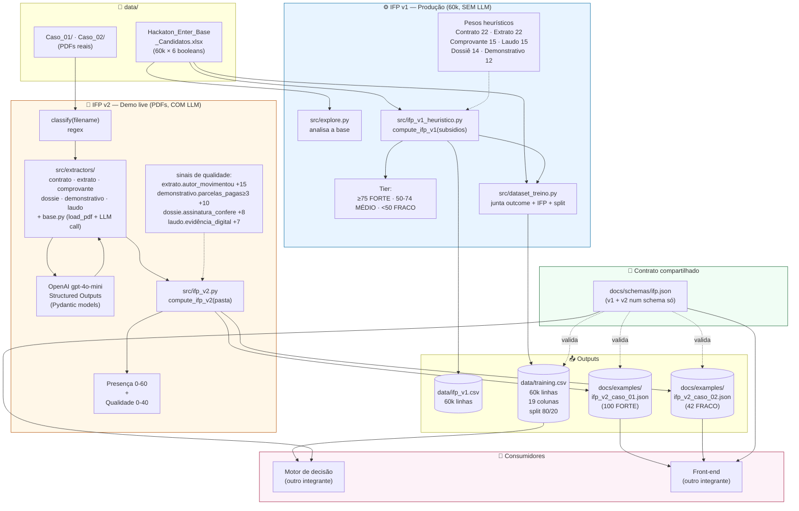

# Arquitetura do IFP

Fluxo atual do Índice de Força Probatória implementado na branch `backend`.
Dois modos de operação que compartilham o mesmo schema de saída.

## Diagrama

## Como ler

**IFP v1 (azul) — batch, sem LLM:**

- Lê só a matriz booleana de presença da aba "Subsídios" do xlsx.
- Aplica pesos heurísticos (soma 100) calibrados pelo lift empírico da base.
- Produz `data/ifp_v1.csv` com score/tier para os 60k processos.
- Alimenta `data/training.csv` (outcome + presença + IFP + split 80/20 estratificado) pro motor de decisão treinar.
- **Uso real:** produção histórica e feature pro motor.

**IFP v2 (laranja) — live, com LLM:**

- Lê uma pasta de processo com PDFs.
- Classifica cada PDF por regex no nome (ex: `02_Contrato_*.pdf` → `contrato`).
- Chama um extractor por tipo, cada um com Pydantic model + `gpt-4o-mini` via Structured Outputs.
- Compõe score como presença (0-60) + qualidade (0-40), onde qualidade premia sinais específicos cross-documento.
- **Uso real:** demo ao vivo nos 2 casos-exemplo. Não escala pros 60k porque a base histórica não contém PDFs.

**Contrato compartilhado (verde):**

- [`docs/schemas/ifp.json`](schemas/ifp.json) define os campos estáveis consumidos por motor e front.
- Versão `v1` e `v2` coexistem no mesmo schema — `componentes`, `features` e `sinais_fortes` são opt-in em v2. Consumidores v1 seguem funcionando quando o output é v2.

**Consumidores (rosa):**

- Motor de decisão treina em cima de `training.csv` ou aplica regras sobre o JSON do IFP.
- Front-end renderiza os JSONs de exemplo (`ifp_v2_caso_*.json`) para o termômetro de força probatória.

## Referências

- [ADR 0001 — Desenho do IFP v1](decisions/0001-ifp-v1-design.md)
- [ADR 0002 — IFP v2 (extração via LLM + camada de qualidade)](decisions/0002-ifp-v2-extraction.md)
- [Schema formal](schemas/ifp.json)
